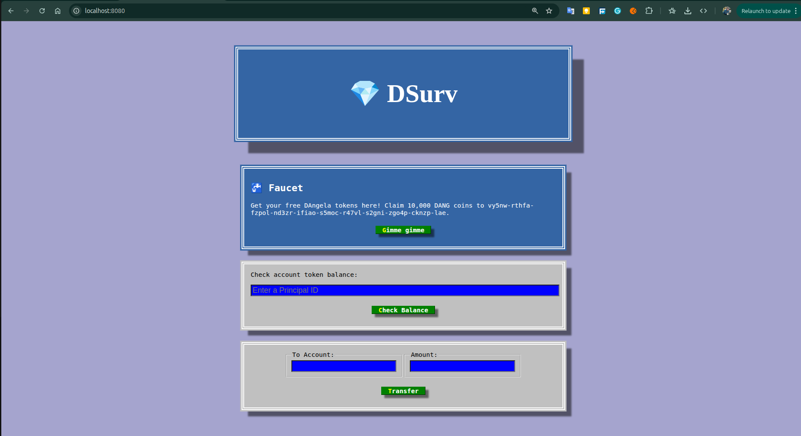

# 💠 ICP Token DApp (DTAN)

A decentralized web application built on the **Internet Computer (ICP)** blockchain using **Motoko** for backend smart contracts and **React** for the frontend interface.  
This project demonstrates how to integrate **Internet Identity authentication**, create a simple **token canister**, and interact with it from a modern web app.

---

## Features

- 🔑 **Login with Internet Identity**
- 💰 **Mint (Faucet)** — Users can claim 10,000 DTAN tokens (only once)
- 💳 **Check Balance** — Displays token balance for logged-in user
- 🔄 **Transfer Tokens** — Send DTAN tokens to another ICP principal
- ♻️ **Stable Data** — Uses `preupgrade` / `postupgrade` to persist balances

---

## 🧠 Tech Stack

| Layer                    | Technology                                                                                      |
| ------------------------ | ----------------------------------------------------------------------------------------------- |
| Backend (Smart Contract) | [Motoko](https://internetcomputer.org/docs/current/motoko/main/motoko-introduction)             |
| Frontend                 | [React.js](https://react.dev/)                                                                  |
| Authentication           | [Internet Identity](https://identity.ic0.app/)                                                  |
| Local Development        | [DFX SDK](https://internetcomputer.org/docs/current/developer-docs/quickstart/quickstart-intro) |

---

## 📂 Project Structure

```
project-root/
├── src/
│   ├── token/
│   │   └── main.mo           # Motoko backend canister
│   ├── frontend/
│   │   ├── src/
│   │   │   ├── components/
│   │   │   │   ├── App.jsx
│   │   │   │   ├── Header.jsx
│   │   │   │   ├── Faucet.jsx
│   │   │   │   ├── Balance.jsx
│   │   │   │   └── Transfer.jsx
│   │   │   └── index.jsx     # React entry file + Internet Identity login
│   │   └── package.json
├── dfx.json                   # ICP project configuration
└── README.md
```

---

## 🧩 Motoko Canister Overview

File: `src/token/main.mo`

### Key Functions

| Function                               | Description                                   |
| -------------------------------------- | --------------------------------------------- |
| `balanceOf(account: Principal)`        | Returns balance of a given principal          |
| `getSymbol()`                          | Returns token symbol (`DTAN`)                 |
| `payOut()`                             | Allows a new user to claim 10,000 tokens once |
| `transfer(to: Principal, amount: Nat)` | Sends tokens between principals               |
| `preupgrade()` / `postupgrade()`       | Persist balances across canister upgrades     |

---

## 🖥️ Frontend Overview

File: `src/frontend/src/index.jsx`

- Uses `@dfinity/auth-client` for authentication.
- Once logged in, user’s **Principal ID** is passed to the React App.
- The main UI (App.jsx) displays **Faucet**, **Balance**, and **Transfer** components.

### Internet Identity Flow

1. User clicks **Login with Internet Identity**
2. Redirects to [identity.ic0.app](https://identity.ic0.app)
3. On success → returns user principal → initializes canister actor

---

## ⚙️ Setup & Run Locally

### 1️⃣ Install Dependencies

Make sure you have the latest **DFX SDK**:

```bash
sh -ci "$(curl -fsSL https://smartcontracts.org/install.sh)"
dfx --version
```

Then install Node modules for frontend:

```bash

npm install
```

---

### 2️⃣ Start Local Replica

```bash
dfx start
```

---

### 3️⃣ Deploy Canisters Locally in another terminal

```bash
dfx deploy
```

---

### 4️⃣ Run the Frontend (React)

```bash
npm start
```

> The app will open in your browser and connect to your local replica http://localhost:8080/.  
> For authentication, you can either use the real Internet Identity or mock login for local dev.

---

## 🌐 Deploying to ICP Mainnet

To deploy to the main Internet Computer network, you’ll need **cycles**.

### Steps:

1. Create or use an identity:
   ```bash
   dfx identity new my-identity
   dfx identity use my-identity
   ```
2. Get your principal:
   ```bash
   dfx identity get-principal
   ```
3. Request cycles from [DFINITY Faucet](https://faucet.dfinity.org/)
4. Deploy to mainnet:
   ```bash
   dfx deploy --network ic
   ```

---

## 🪙 Token Details

| Property            | Value                                                             |
| ------------------- | ----------------------------------------------------------------- |
| **Token Name**      | DTAN                                                              |
| **Symbol**          | `DTAN`                                                            |
| **Total Supply**    | 1,000,000,000                                                     |
| **Owner Principal** | `imnip-motn2-ct3w5-thnbc-k5wfd-bxy36-niaxz-ybypr-bdrqt-nbxq4-2ae` |

---

## 🖼️ Screenshot

> Add a preview of your app UI here!
> 

## 📜 License

This project is open-source and available under the [MIT License](LICENSE).

---

## 🤝 Author

**Abdelrahman Ali**  
💻 Web3 & Blockchain Developer  
🌐 [LinkedIn](https://www.linkedin.com/in/abdelrahman-ali-04664a185/) | 🐙 [GitHub](https://github.com/abdo-ali)

---

> 💡 _Tip:_ If you’d like to extend this project, you can add NFT minting, token metadata, or integrate with Ledger for real ICP transfers.
